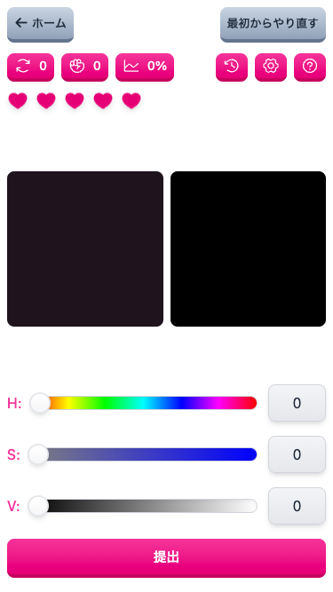
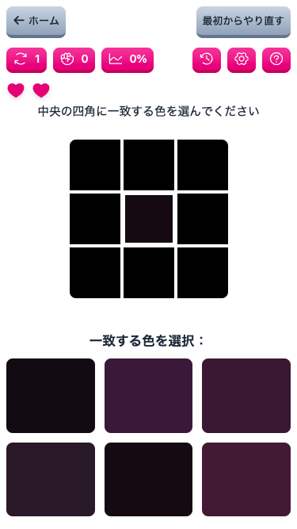
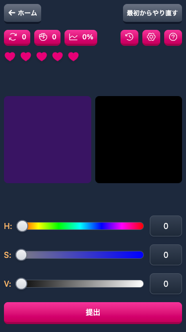
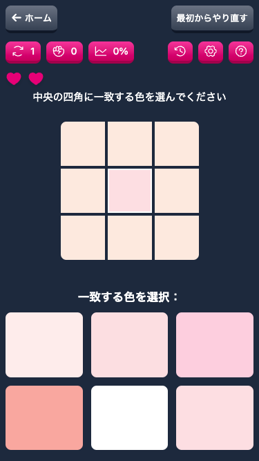
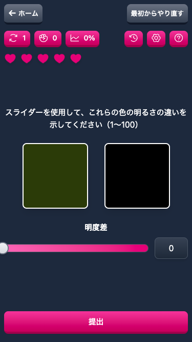

# Chami Match

言語: [English](README.md) | [日本語](README.ja.md) | [繁體中文](README.zh-TW.md)

[プロジェクトダッシュボード](https://github.com/users/Yukaii/projects/11/views/1)

## ゲームプレイ

| 画面               | スクリーンショット                                                      |
| ------------------ | ---------------------------------------------------------------------- |
| ウェルカム         |   |
| 標準モード         |      |
| コンテキストモード |  |
| 明度差モード       |  |

### ダークモード

| 画面               | スクリーンショット                                                     |
| ------------------ | --------------------------------------------------------------------- |
| ウェルカム         |   |
| 標準モード         |      |
| コンテキストモード |  |
| 明度差モード       |  |

## クレジット

このゲームは[color-test](https://dream7fragment.itch.io/color-test)のアイデアを元にしています。素晴らしいアイデアをありがとう、[Fragment](https://www.facebook.com/Dream7Fragment)！

## ライセンス

MIT
