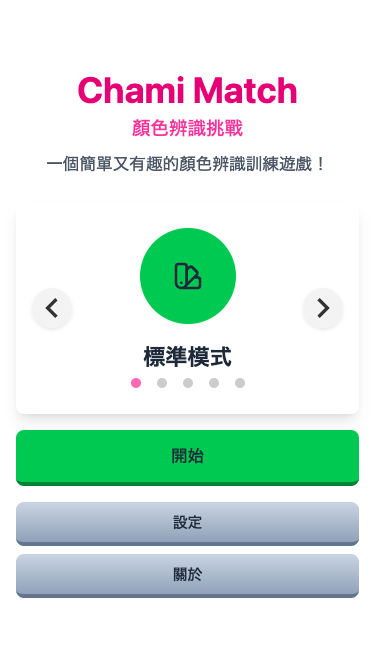
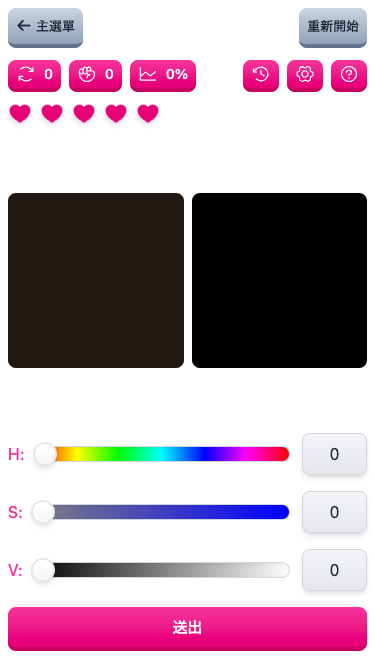
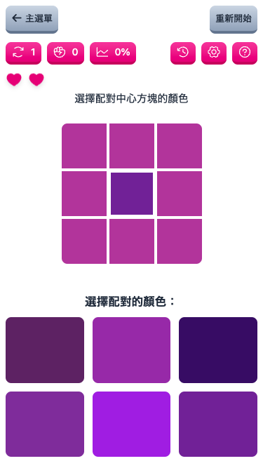
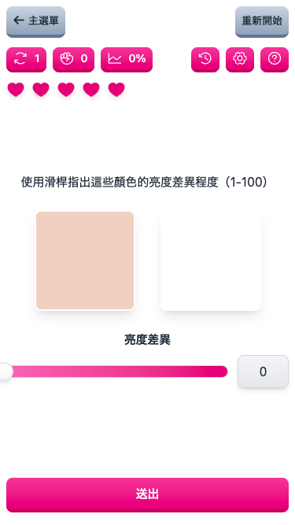
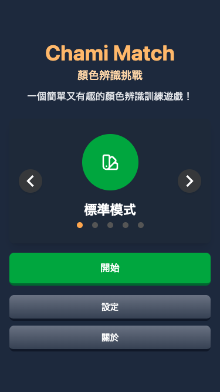
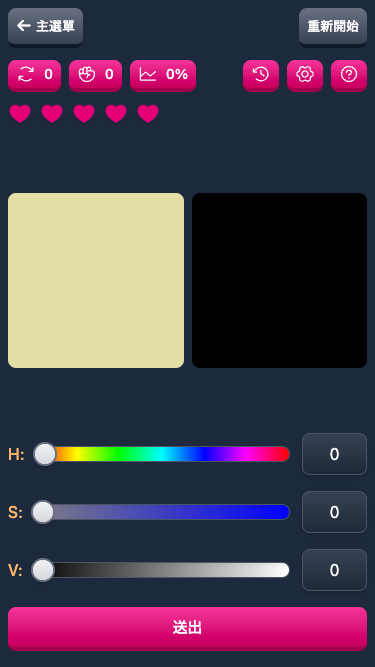
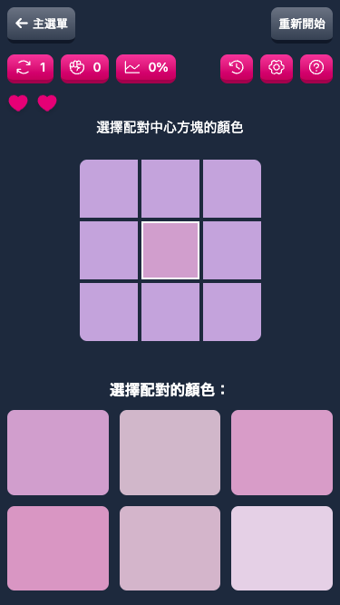
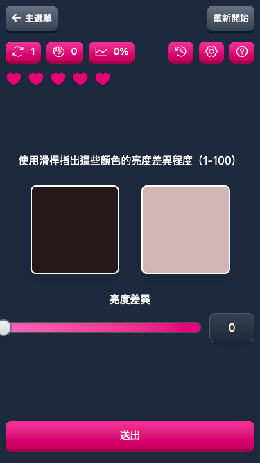

# Chami Match

語言: [English](README.md) | [日本語](README.ja.md) | [繁體中文](README.zh-TW.md)

[專案儀表板](https://github.com/users/Yukaii/projects/11/views/1)

## 遊戲畫面

| 畫面         | 截圖                                                                            |
| ------------ | ------------------------------------------------------------------------------- |
| 歡迎頁面     |        |
| 標準模式     |           |
| 情境模式     |   |
| 亮度差異模式 |  |
| 圖片模式     |     |
| 記憶模式      |     |

### 暗黑模式

| 畫面             | 截圖                                                                    |
| ---------------- | ----------------------------------------------------------------------- |
| 歡迎頁面         |  |
| 標準模式         |     |
| 情境模式         |  |
| 亮度差異模式     |  |
| 圖片模式         |     |
| 記憶模式         |     |

## 致謝

這個遊戲的原始概念來自[color-test](https://dream7fragment.itch.io/color-test)。感謝 [Fragment](https://www.facebook.com/Dream7Fragment) 的精彩創意！

## 授權條款

MIT
