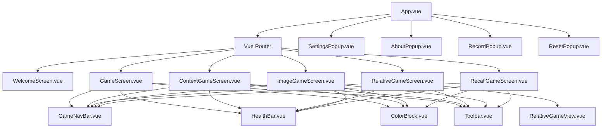
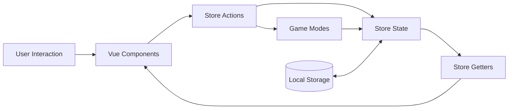
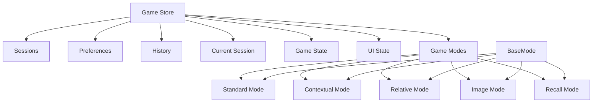
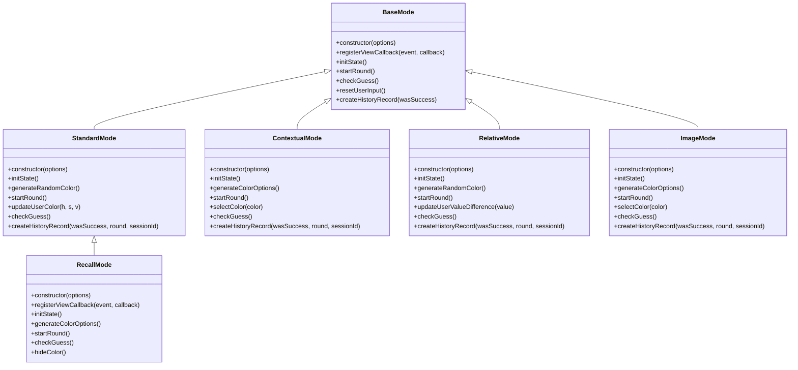
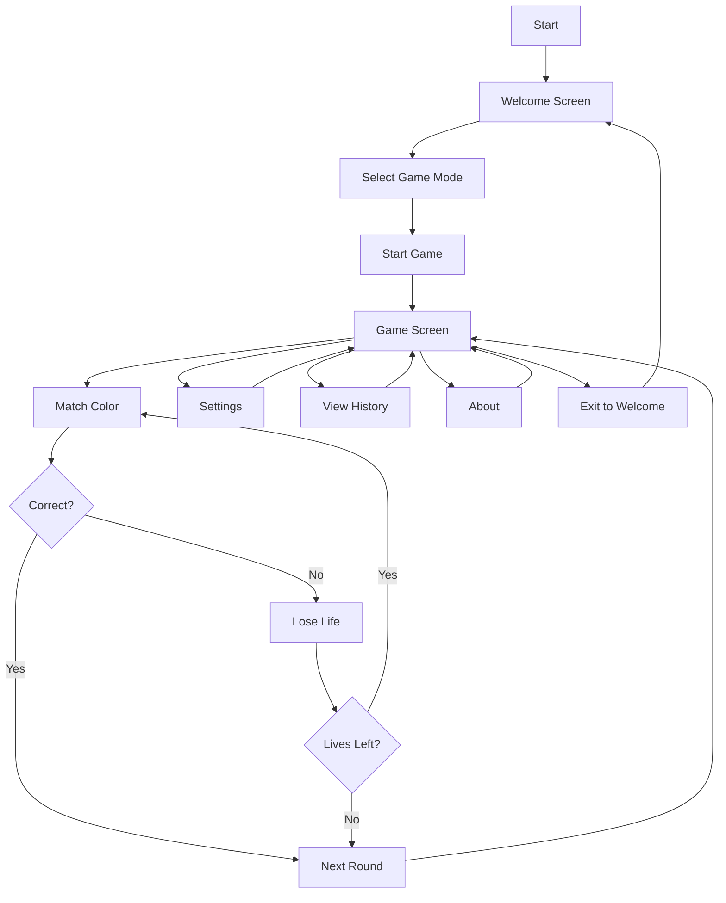
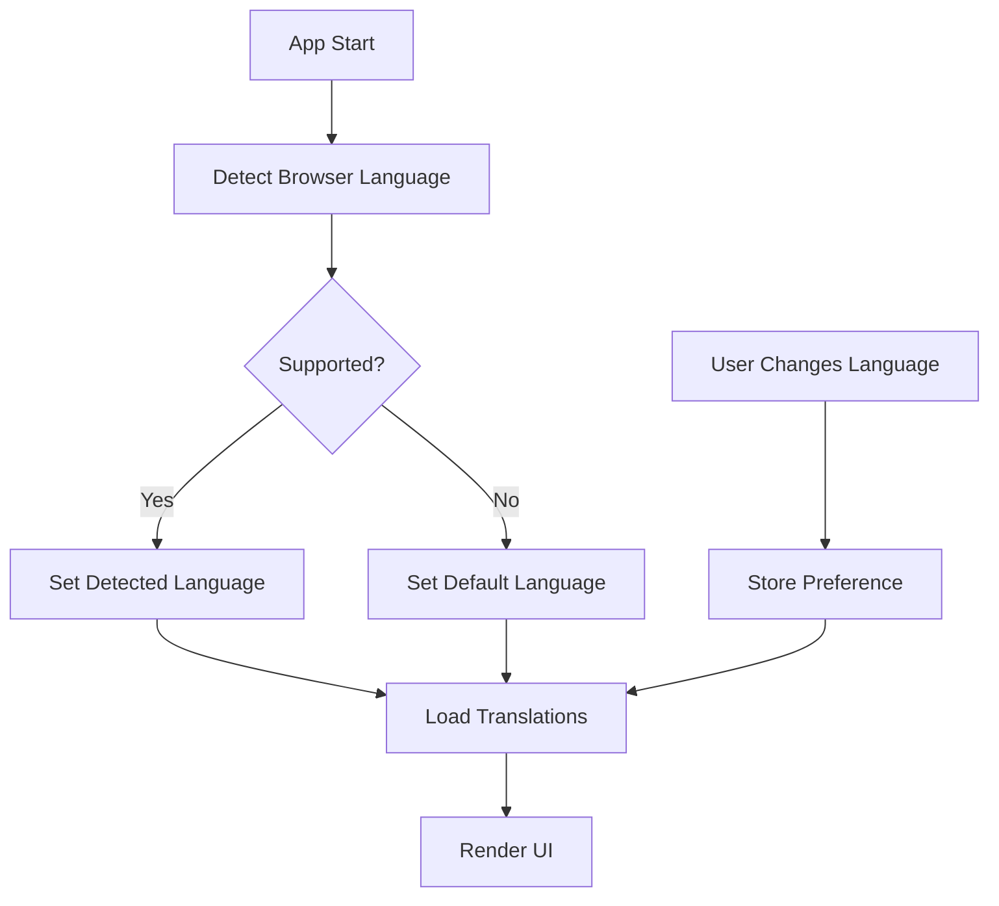
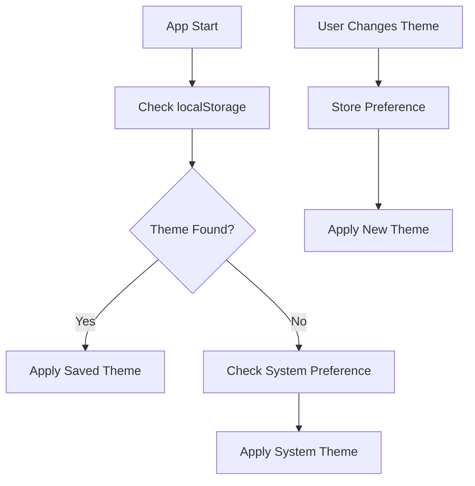

# Chami Match - Technical Diagrams

This document provides visual representations of the application's architecture, data flow, and component relationships.

## Component Hierarchy

## Data Flow

## State Management

## Game Mode Class Diagram

## User Flow

## Internationalization Flow

## Theme Management Flow

